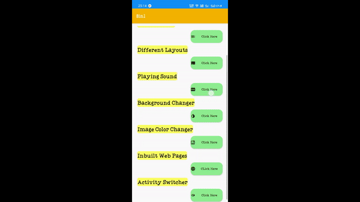
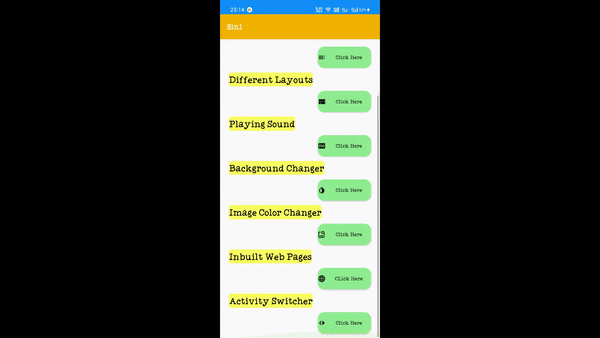

# 8in1 (An Android App)
  An android Application, which is having total 8 apps features. This app is build on Android Studio, using Java: Language for backend. And used C+XML for front end Development   (UI) design.
  
## App Features
   - Splash Screen
   
    
        
        
   - Button and Toast
   
        

   - Clickable List
   
        
        
   - Different Layouts of Android
      * Relative Layout
      * Constraint Layout
      * Linear Layout
      * Grid Layout
      
      
      
      
   -  Sound Feature
      
      
      
      
   - Background Color Changer
   
        
   
   
   - Image Color Changer
   
      
        
   - Inbuilt Webpages
   
        
   
   - Activity Switcher
   
        
  
